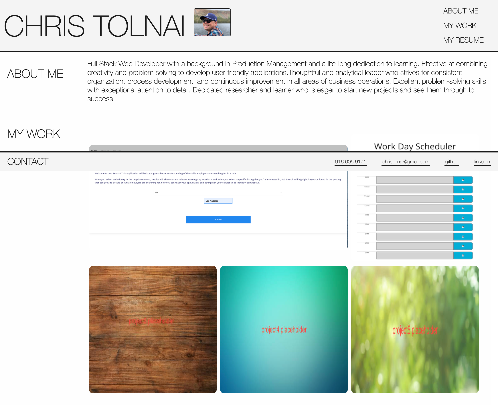

# chris-tolnai-portfolio

## Description
Here is my portfolio of the work that I have completed during the UCLA Extension Coding Bootcamp.  As I complete more projects I will add to this page.

This page was created using only html and CSS.

## Usage
https://ctolnai.github.io/chris-tolnai-portfolio/

https://github.com/ctolnai/chris-tolnai-portfolio/

## License and copyright

(c) Chris Tolnai 

Licensed under the [MIT License](LICENSE).